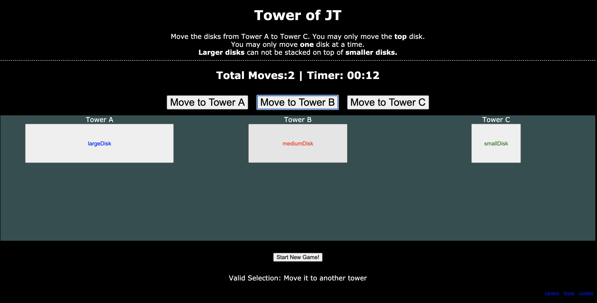
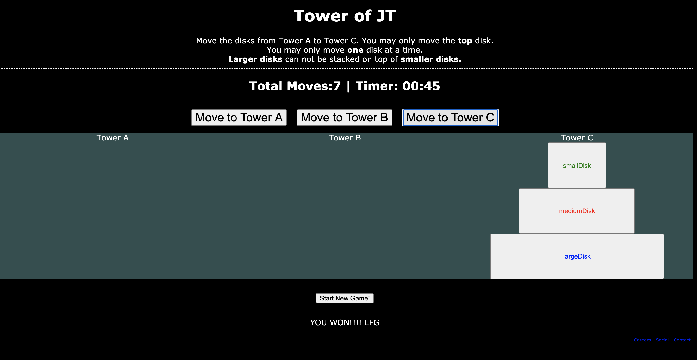

## Project Choice (Tell us which project you're doing!)

- [ ] Flash Cards
- [ ] Trivia (Self-scoring)
- [ ] Spaceman
- [x] Tower of Hanoi
- [ ] Simon

## Project Description

> A short description of your game.

Tower of Hanoi is a puzzle game that requires the player to shift each of any number of different sized disks from stack 1 into stack 3, in order from largest to smallest, preventing a larger disk from being placed on top of a smaller one.

## Wire Frames

> Copy and paste or drag and drop your images here.

## User Stories

> Add user stories following the _As a [type of user], I want [what the user wants], so that [what it helps accomplish]_ format.

- as a player, I want to be able to see and interact with my game, so that I can play
- as a player, I want an intro screen that explains the rules so I know how to play
- as a player, I want to be able to click disks and place them onto other stacks.
- as a player, I want to be able to track the number of "moves", I've made.
- as a player, I want to be able to reset the game if I am stuck.
- as a player, I want the game to recognize a win, and have some sort of visual representation that I've won.

### MVP Goals

- Visual game board:
- Display rules and a start game button
- Move Counter
- Identify each stack and disk
- know the difference between disk selections and disk placements
- evaluate placements such that we prevent a larger disk from being placed on top of a smaller disk and know if there's a win.
- evaluate a win and display a winning message

### Stretch Goals

- customization for # of disks
- Click and drag a disk to another stack
- calculate the least # of moves required for each # of disks and display it.
- modal for intro message and win message.
- gfx/emphasis to show when you've grabbed a disk and placed it elsewhere. GOT THIS DONE!
- make stacks graphics of the world's tallest buildings

## Technologies

- HTML
- CSS
- JavaScript
- MF'in Google

## Installation

- open a web browser and navigate to [my personal website.](http://www.jamesetomassoni.com)
- be gentle.

## Screenshots

### Starting:

### In-Game

### Winner

## Unsolved Mysteries

- thinking you're at MVP when you aren't.
- .....almost all of my stretch goals related to styling
  - click and drag
  - background graphics
  - CSS will be the death of me. My next project will be to rebuild this using react and bootstrap.
- Evaluating a win felt kind of cheap.
- Calculate the minimum # of moves
  - wrap my head around the pattern of moves per disk :facepalm:

## Solved Mysteries

- nodeLists != Arrays. We can use _some_ array methods on nodeLists and they look similar in the console, however, it's much more effective to swap the nodeList into an array. These are commonly found with **_querySelectorAll_** as well as anytime you use the **_object.childNodes_**, as well as many other scenarios.
- I didn't ever really acknowledge learning any of this, but with a couple nudges in the right direction by teammates and instructors, I was able to make this work, and that feels fantastic.
